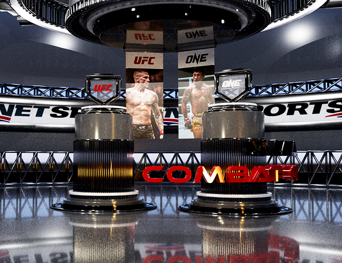
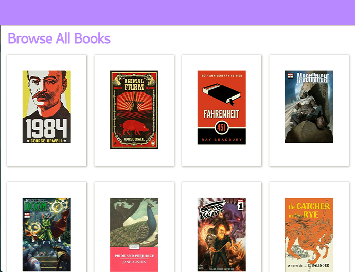

# Welcome to my portfolio!

This is my portfolio to show off my skills as a front-end developper. Shoot me a message or email if you are interested in creating a project together.

## Experience

I am a graduate from Fanshawe College's Interactive Media and Design (IDP) program.

I have experience using: various coding languages like HTML, CSS, JS, PHP, etc.

## Usage

Fork the repo to find my contact and resume!

You can also find links to all my socials in my portfolio as well!

## Hobbies and Interests

I love horror movies, collecting comic books, and practising muay thai. I'm also a big fight fan as well and have been watching MMA for about 8 years.

## History

This is the first iteration of my portfolio. I will be making future updates to this depending on my career paths, project archives, and future hobbies.

## Credits

Portfolio created by Zeran Lu.

## License

MIT